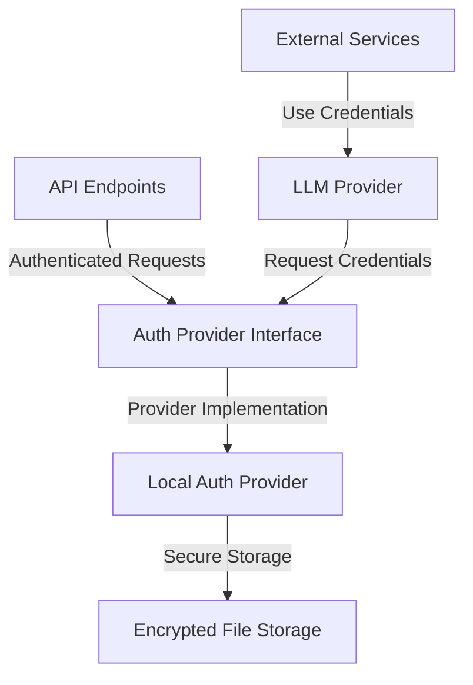

# Auth Provider

## Overview

The Auth Provider system manages secure credential storage and access for LLM providers, supporting both local and cloud-based models while maintaining strict security practices. It provides a unified interface for securely storing, retrieving, and managing API keys and other sensitive credentials required for accessing various LLM services.

## Core Principles

- **Security First**: All credentials are encrypted at rest using industry-standard encryption
- **Extensible**: Support for multiple provider types with a consistent interface
- **Flexible Authentication**: Session-based authentication with admin token support
- **API Driven**: Complete RESTful API for credential management

## Architecture

The Auth Provider system consists of several core components that work together to provide secure credential management:



### Component Responsibilities

1. **Auth Provider Interface**: Defines the contract for credential management
2. **Provider Implementations**: Concrete implementations for different storage mechanisms
3. **Secure Storage**: Handles encryption and persistent storage of credentials
4. **API Endpoints**: RESTful interface for credential management

## Core Components

### Auth Provider Interface

The `AuthProviderInterface` defines the contract that all auth provider implementations must follow:

```python
class AuthProviderInterface(ABC):
    @abstractmethod
    async def validate_session(self, session_token: str) -> bool:
        """Validates if the provided session token is valid and authorized."""
        
    @abstractmethod
    async def get_credentials(self, session_token: str, provider_id: str) -> Dict[str, Any]:
        """Retrieves stored credentials for a specific provider."""
        
    @abstractmethod
    async def store_credentials(self, session_token: str, provider_id: str, credentials: Dict[str, Any]) -> None:
        """Securely stores credentials for a specific provider."""
        
    @abstractmethod
    async def remove_credentials(self, session_token: str, provider_id: str) -> None:
        """Removes stored credentials for a specific provider."""
        
    @abstractmethod
    async def list_providers(self, session_token: str) -> Dict[str, Dict[str, Any]]:
        """Lists all providers with stored credentials."""
```

### Local Auth Provider

The `LocalAuthProvider` implements the `AuthProviderInterface` for local storage:

- Uses file-based secure storage with encryption
- Supports session-based authentication
- Includes admin token for initial setup and access
- Manages credential metadata

### Secure Storage

The `SecureStorage` class handles the secure storage and retrieval of credentials:

- Encryption using Fernet symmetric encryption
- Secure key derivation with PBKDF2
- File-based persistent storage
- Metadata tracking for credentials

## API Endpoints

The Auth Provider system exposes the following RESTful API endpoints:

| Method | Endpoint                       | Description                           | Authentication |
|--------|--------------------------------|---------------------------------------|---------------|
| POST   | /api/v1/auth/providers         | Store provider credentials            | Bearer Token  |
| GET    | /api/v1/auth/providers         | List all providers                    | Bearer Token  |
| GET    | /api/v1/auth/providers/{id}    | Get provider details                  | Bearer Token  |
| DELETE | /api/v1/auth/providers/{id}    | Remove provider credentials           | Bearer Token  |
| GET    | /api/v1/auth/provider-types    | List available provider types         | None          |
| POST   | /api/v1/auth/validate          | Validate authentication token         | None          |

### Request/Response Examples

#### Store Provider Credentials

**Request:**
```http
POST /api/v1/auth/providers
Authorization: Bearer {admin_token}
Content-Type: application/json

{
  "provider_id": "anthropic-test",
  "provider_type": "anthropic",
  "credentials": {
    "api_key": "test-api-key",
    "api_base": "https://api.anthropic.com/v1",
    "model": "claude-3-opus-20240229"
  }
}
```

**Response:**
```json
{
  "success": true,
  "data": {
    "provider_id": "anthropic-test"
  },
  "error": null,
  "metadata": {
    "timestamp": "N/A"
  }
}
```

#### List Providers

**Request:**
```http
GET /api/v1/auth/providers
Authorization: Bearer {admin_token}
```

**Response:**
```json
{
  "success": true,
  "data": {
    "anthropic-test": {
      "provider_id": "anthropic-test",
      "provider_type": "anthropic",
      "created": 1708824367.5,
      "modified": 1708824367.5,
      "size": 327
    }
  },
  "error": null,
  "metadata": {
    "timestamp": "N/A"
  }
}
```

## Configuration

### Environment Variables

The Auth Provider system requires the following environment variables:

| Variable            | Description                                        | Required |
|--------------------|----------------------------------------------------|----------|
| MARVIN_MASTER_KEY  | Master encryption key for credential storage       | Yes      |
| MARVIN_ADMIN_TOKEN | Admin token for initial setup and authentication   | Yes      |

### Directory Structure

The Auth Provider stores its configuration and encrypted credentials in:

```
config/
└── auth/
    └── local_credentials/
        └── {provider_id}.enc
```

## Security Considerations

1. **Encryption**: All credentials are encrypted at rest using Fernet symmetric encryption
2. **Key Management**: Master encryption key should be stored securely
3. **Session Management**: Session tokens have configurable expiration
4. **Admin Access**: Admin token provides initial access and setup capability

## Integration with LLM Providers

The Auth Provider system integrates with the LLM Provider system by:

1. Providing secure credential storage
2. Supporting multiple provider types (Anthropic, OpenAI, local models, etc.)
3. Enabling runtime credential retrieval for API calls

## Error Handling

The system uses specialized exceptions for different error conditions:

| Exception                | Description                                   |
|--------------------------|-----------------------------------------------|
| AuthorizationError       | Session invalid or unauthorized               |
| CredentialNotFoundError  | Requested credentials do not exist            |
| StorageError             | General storage operation failure             |
| EncryptionError          | Encryption/decryption failure                 |
| ValidationError          | Credential validation failure                 |
| ConfigurationError       | Auth provider configuration issue             |

## Extending the System

### Adding New Provider Types

To add support for a new LLM provider type:

1. Register the provider type in `AuthProviderConfig`:
   ```python
   _provider_registry["new_provider"] = NewProviderClass
   ```

2. Create type-specific validation in the provider implementation

### Custom Auth Provider Implementation

To create a custom auth provider implementation:

1. Implement the `AuthProviderInterface` abstract class
2. Register the implementation in the provider registry
3. Add appropriate configuration and credential validation

## Usage Example

```python
from core.infrastructure.auth.config import get_auth_provider_config

# Get auth provider configuration
auth_config = get_auth_provider_config("config/auth")

# Get local auth provider
local_provider = auth_config.get_provider("local")

# Validate session
is_valid = await local_provider.validate_session(admin_token)

# Store credentials
await local_provider.store_credentials(
    admin_token,
    "anthropic-provider",
    {
        "provider_type": "anthropic",
        "api_key": "your-api-key",
        "api_base": "https://api.anthropic.com/v1"
    }
)

# Retrieve credentials
credentials = await local_provider.get_credentials(admin_token, "anthropic-provider")
```