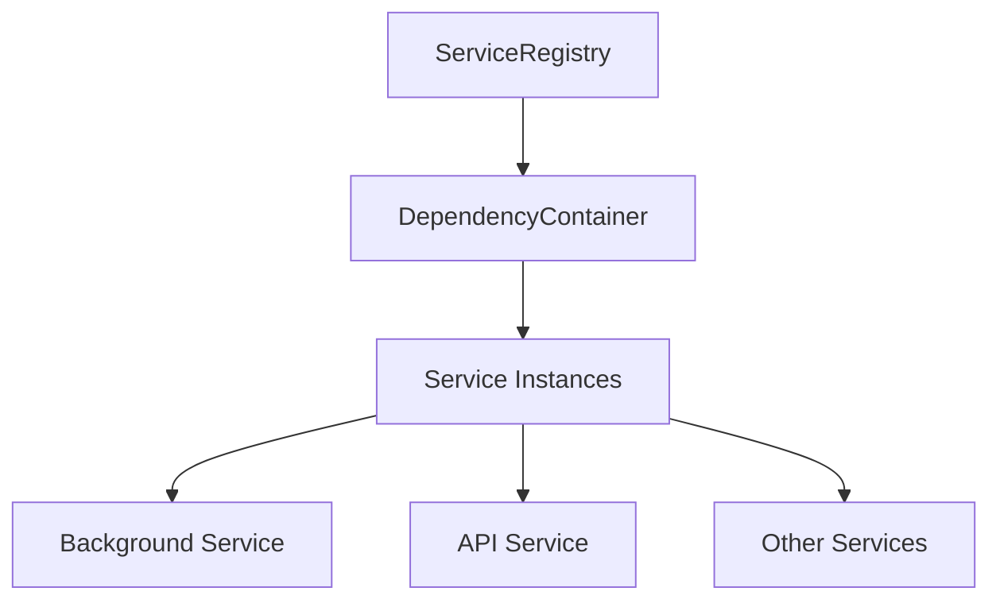
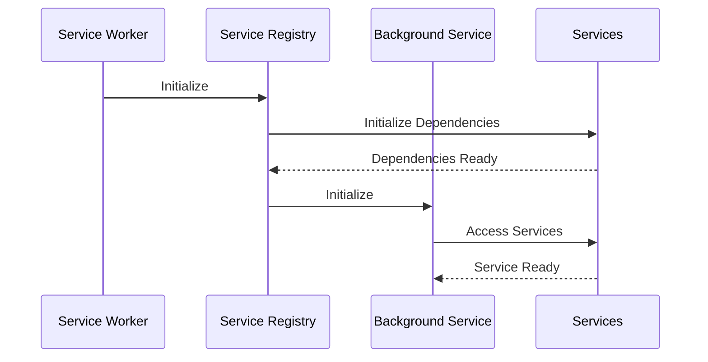
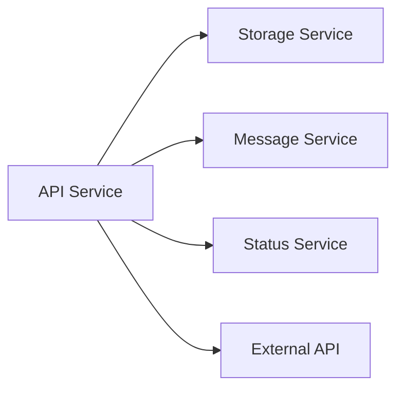

# Service Architecture

## Overview

The Marvin extension uses a service-oriented architecture with dependency injection to manage its components. This document outlines the service architecture, initialization patterns, and interactions between services, the background worker, and the API.

## Service Registry Pattern

### Core Components



### Service Registration

Services are registered in the `ServiceRegistry` with their dependencies:

```javascript
// Example service registration
ServiceRegistry.registerService('statusService', StatusService, {
    dependencies: ['storage', 'message', 'api']
});
```

### Service Initialization Chain

1. **Container Initialization**
   ```javascript
   // 1. Container is created
   const container = new DependencyContainer();
   
   // 2. ServiceRegistry registers services
   ServiceRegistry.registerAll();
   
   // 3. Services are initialized in dependency order
   await ServiceRegistry.initializeAll();
   ```

2. **Service Instance Creation**
   ```javascript
   // When a service is requested:
   const service = await ServiceRegistry.getService('statusService');
   // 1. Dependencies are initialized first
   // 2. Service instance is created
   // 3. Service.initialize() is called
   // 4. Instance is cached
   ```

3. **Service Lifecycle**
   ```javascript
   class ExampleService extends BaseService {
     async _performInitialization() {
       // 1. Create logger
       this._logger = new LogManager({...});
       
       // 2. Resolve dependencies
       await this._resolveDependencies();
       
       // 3. Set up service
       await this._setupService();
     }
     
     async _performCleanup() {
       // 1. Clean up resources
       // 2. Clear references
       // 3. Reset state
     }

     // Service-specific cleanup for memory pressure
     async _performServiceSpecificCleanup(pressureLevel) {
       // Implement service-specific cleanup logic
       // Called by base class during memory pressure handling
     }
   }
   ```

## Service Dependencies

### Core Services

| Service | Dependencies | Description |
|---------|--------------|-------------|
| storage | - | Persistent storage management |
| api | storage | API communication |
| message | storage, api | Inter-service messaging |
| status | storage, message, api | System status monitoring |
| notification | storage, message | User notifications |
| task | storage, message, api | Background tasks |
| analysis | storage, api | Content analysis |
| graph | storage, analysis | Knowledge graph |
| visualization | storage, graph, analysis | Data visualization |

### Dependency Resolution

1. **Validation**
   - Circular dependencies are detected
   - Missing dependencies are reported
   - Dependency order is enforced

2. **Initialization Order**
   - Dependencies are initialized first
   - Services are initialized in dependency order
   - Initialization failures are handled gracefully

## Memory Management

### Resource Tracking

1. **Resource Types**
   ```javascript
   class BaseService {
     constructor() {
       this._resourceTracker = new ResourceTracker();
       this._memoryMonitor = new MemoryMonitor();
     }
   }
   ```

2. **Resource Management**
   - Event listeners tracked via ResourceTracker
   - DOM references managed with WeakMap/WeakSet
   - Timers and intervals properly cleaned up
   - WebSocket connections monitored
   - Message ports tracked and cleaned up

### Memory Pressure Handling

1. **Pressure Levels**
   ```javascript
   // Base service handles pressure levels
   async _handleMemoryPressure(snapshot) {
     const usageRatio = snapshot.usedJSHeapSize / snapshot.jsHeapSizeLimit;
     const pressureLevel = usageRatio > 0.9 ? 'high' : usageRatio > 0.8 ? 'medium' : 'low';
     
     // Call service-specific cleanup
     await this._performServiceSpecificCleanup(pressureLevel);
     
     // Perform base cleanup based on pressure level
     switch (pressureLevel) {
       case 'high':
         await this._cleanupNonEssentialResources();
         await this._cleanupTasks();
         break;
       case 'medium':
         await this._cleanupNonEssentialResources();
         break;
     }
   }
   ```

2. **Service-Specific Cleanup**
   - Each service implements `_performServiceSpecificCleanup`
   - Cleanup logic based on pressure level
   - Resource-specific cleanup strategies
   - Cache management and eviction

### Memory Monitoring

1. **Metrics Tracking**
   ```javascript
   class BaseService {
     getMetrics() {
       return {
         memoryUsage: this._memoryMonitor.getLastSnapshot(),
         resourceCounts: this._resourceTracker.getResourceCounts(),
         activeTasks: this._activeTasks.size,
         // Service-specific metrics
       };
     }
   }
   ```

2. **Resource Limits**
   - Maximum cache sizes
   - Task limits
   - Connection limits
   - Event listener limits

## Background Worker Integration

### Service Worker Lifecycle



### Background Service Responsibilities

1. **Service Management**
   - Maintains service instances
   - Handles service lifecycle
   - Manages service state
   - Monitors memory usage

2. **Message Handling**
   - Routes messages between services
   - Manages service communication
   - Handles API requests
   - Tracks message ports

3. **State Management**
   - Maintains global state
   - Syncs state between services
   - Persists state changes
   - Handles state cleanup

## API Integration

### API Service Pattern



### API Communication Flow

1. **Request Flow**
   ```javascript
   // 1. Service makes request
   const response = await this._apiService.request({
     endpoint: '/api/v1/endpoint',
     method: 'POST',
     data: payload
   });
   
   // 2. API Service handles:
   // - Authentication
   // - Rate limiting
   // - Error handling
   // - Response parsing
   // - Resource tracking
   ```

2. **Error Handling**
   ```javascript
   try {
     const response = await this._apiService.request({...});
   } catch (error) {
     if (error.isNetworkError) {
       // Handle network issues
     } else if (error.isAuthError) {
       // Handle auth issues
     } else {
       // Handle other errors
     }
   }
   ```

## Best Practices

### Service Implementation

1. **Initialization**
   - Always extend BaseService
   - Implement _performInitialization
   - Handle dependencies properly
   - Use proper error handling
   - Track all resources

2. **Resource Management**
   - Use ResourceTracker for all resources
   - Implement proper cleanup
   - Handle memory pressure
   - Monitor resource usage
   - Use WeakMap/WeakSet for references

3. **Error Handling**
   - Use proper error types
   - Implement retry logic
   - Handle edge cases
   - Log errors properly
   - Clean up on error

### Service Communication

1. **Message Passing**
   - Use MessageService for inter-service communication
   - Define clear message types
   - Handle message responses
   - Implement timeouts
   - Track message ports

2. **State Management**
   - Use StorageService for persistence
   - Implement state validation
   - Handle state conflicts
   - Monitor state changes
   - Clean up old state

## Common Issues and Solutions

### Initialization Issues

1. **Circular Dependencies**
   - Use message passing instead of direct dependencies
   - Implement lazy initialization
   - Use event-based communication
   - Track dependency health

2. **Missing Dependencies**
   - Validate dependencies at registration
   - Implement fallback behavior
   - Log dependency issues
   - Monitor dependency state

3. **Initialization Failures**
   - Implement retry logic
   - Provide fallback behavior
   - Log initialization errors
   - Clean up on failure

### Resource Management

1. **Memory Leaks**
   - Track all resources
   - Implement proper cleanup
   - Monitor memory usage
   - Handle memory pressure
   - Use WeakMap/WeakSet

2. **Resource Cleanup**
   - Implement cleanup methods
   - Clear all references
   - Reset service state
   - Log cleanup actions
   - Handle cleanup errors

## Testing

### Service Testing

1. **Unit Tests**
   ```javascript
   describe('StatusService', () => {
     let service;
     
     beforeEach(async () => {
       service = new StatusService();
       await service.initialize();
     });
     
     afterEach(async () => {
       await service.cleanup();
     });
     
     test('initializes properly', () => {
       expect(service._initialized).toBe(true);
     });

     test('handles memory pressure', async () => {
       const snapshot = { usedJSHeapSize: 1000, jsHeapSizeLimit: 1000 };
       await service._handleMemoryPressure(snapshot);
       expect(service._memoryMetrics.cleanupCount).toBeGreaterThan(0);
     });
   });
   ```

2. **Integration Tests**
   ```javascript
   describe('Service Integration', () => {
     let container;
     
     beforeEach(async () => {
       container = new DependencyContainer();
       await ServiceRegistry.initializeAll();
     });
     
     test('services communicate properly', async () => {
       const statusService = await container.getService('statusService');
       const apiService = await container.getService('apiService');
       // Test service interaction
     });

     test('memory pressure handling', async () => {
       const service = await container.getService('taskService');
       const snapshot = { usedJSHeapSize: 1000, jsHeapSizeLimit: 1000 };
       await service._handleMemoryPressure(snapshot);
       // Verify cleanup occurred
     });
   });
   ```

## Monitoring and Debugging

### Service Monitoring

1. **Health Checks**
   - Monitor service status
   - Check resource usage
   - Track error rates
   - Monitor performance
   - Track memory usage

2. **Debugging**
   - Use service logging
   - Monitor message flow
   - Track state changes
   - Debug initialization
   - Monitor resource cleanup

## Future Improvements

1. **Service Registry**
   - Implement service versioning
   - Add service health checks
   - Improve dependency resolution
   - Add service metrics
   - Enhance memory monitoring

2. **Background Service**
   - Improve state management
   - Add service recovery
   - Implement better error handling
   - Add performance monitoring
   - Enhance resource tracking

3. **API Integration**
   - Implement better caching
   - Add request batching
   - Improve error handling
   - Add request metrics
   - Enhance resource cleanup