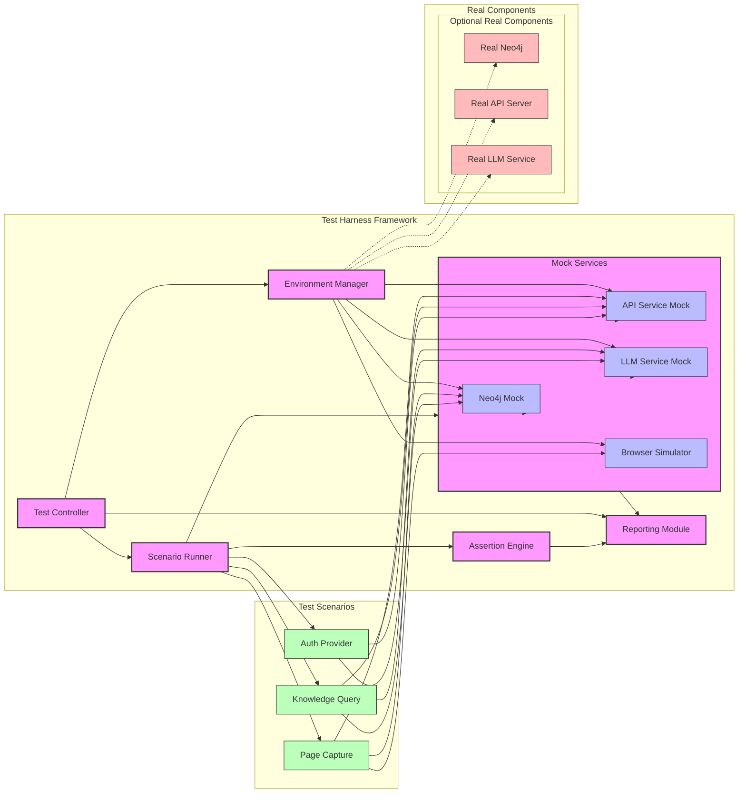
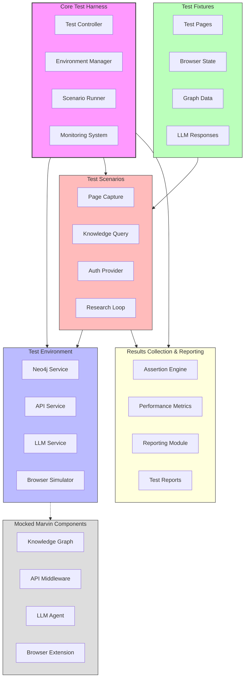

# Marvin Integration Testing and Test Harness Implementation Plan

## Table of Contents

1. [Introduction and Objectives](#introduction-and-objectives)
2. [Integration Testing Strategy](#integration-testing-strategy)
3. [Test Harness Architecture](#test-harness-architecture)
4. [Test Harness Sequence Diagram](test-harness-sequence.md)
5. [Implementation Roadmap](#implementation-roadmap)
6. [Test Scenarios](#test-scenarios)
7. [Environment Setup](#environment-setup)
8. [Mock Services](#mock-services)
9. [Monitoring and Reporting](#monitoring-and-reporting)
10. [Best Practices](#best-practices)
11. [Future Extensions](#future-extensions)

## Introduction and Objectives

### Project Context

Marvin is an intelligent research assistant that helps users organize and leverage their browsing history and research materials. The system comprises five core components:

1. **Content Analysis Pipeline**: Processes web content to extract useful information
2. **Neo4j Knowledge Graph**: Stores and manages relationships between browsing data
3. **Browser Extension**: Provides the user interface and browser integration
4. **LLM Agent**: Leverages language models to provide intelligent assistance
5. **API Layer**: Connects components and provides external interfaces

While these components exist and function individually, the project now requires integration testing to ensure they work together correctly and efficiently.

### Test Harness Objectives

The test harness will provide:

1. **Reproducible Testing Environment**: A consistent, controlled environment for testing component interactions
2. **End-to-End Test Scenarios**: Predefined workflows that exercise multiple components
3. **Component Isolation**: The ability to test specific integration paths with controlled dependencies
4. **Comprehensive Reporting**: Detailed logs and results for troubleshooting and verification
5. **CI/CD Integration**: Support for automated testing in development pipelines

### Current Focus Areas

The initial implementation will focus on:

- Auth Provider integration
- Anthropic LLM provider integration
- Multi-component workflow testing
- Transaction consistency across components

## Integration Testing Strategy

### Integration Paths

We'll focus on testing the following critical integration paths:

#### Path 1: Browser Extension → API → Knowledge Graph
- Tests the core user experience of capturing and storing browsing data
- Verifies proper data flow from user interface to persistent storage
- Validates transaction consistency across API boundaries

#### Path 2: Content Analysis → Knowledge Graph → LLM Agent
- Tests content processing and its availability to the intelligent agent
- Verifies metadata extraction and storage
- Validates context retrieval for AI assistance

#### Path 3: LLM Agent → API → Browser Extension
- Tests insight generation and presentation to the user
- Verifies proper formatting and delivery of AI-generated content
- Validates the complete user experience loop

### Testing Approaches

We'll employ multiple testing approaches:

1. **Isolation Testing**: Testing specific component interfaces with controlled inputs/outputs
2. **Integration Testing**: Testing communication between adjacent components
3. **End-to-End Testing**: Testing complete user workflows across all components
4. **Performance Testing**: Measuring response times and resource usage
5. **Error Handling**: Testing system resilience under failure conditions

## Test Harness Architecture

### Component Overview

The test harness consists of the following components:





1. **Test Controller**: Central orchestrator for test execution
2. **Environment Manager**: Handles setup and teardown of test environments
3. **Mock Services**: Simulates external dependencies and components
4. **Scenario Runner**: Executes specific test workflows
5. **Assertion Engine**: Validates test results against expected outcomes
6. **Monitoring System**: Collects performance metrics and logs
7. **Reporting Module**: Generates test reports and summaries

### Directory Structure

```
marvin-test-harness/
├── config/                  # Test configurations
│   ├── local.json           # Local testing config
│   └── ci.json              # CI environment config
│
├── fixtures/                # Test data
│   ├── pages/               # Sample web pages
│   ├── browser_state/       # Sample browser state
│   └── knowledge_graph/     # Pre-built graph data
│
├── mocks/                   # Mock implementations
│   ├── llm_providers/       # Mock LLM responses
│   ├── browser_extension/   # Simulated browser behavior
│   └── neo4j/               # Mock graph database
│
├── runners/                 # Test execution scripts
│   ├── integration_tests.py # Main integration test runner
│   ├── component_tests.py   # Component-specific test runner
│   └── performance_tests.py # Performance benchmark runner
│
├── scenarios/               # Test scenarios
│   ├── page_capture.py      # Page capture workflow tests
│   ├── knowledge_query.py   # Knowledge retrieval tests
│   └── research_task.py     # Autonomous research tests
│
├── utils/                   # Helper utilities
│   ├── logging.py           # Enhanced logging for tests
│   ├── assertions.py        # Custom test assertions
│   └── cleanup.py           # Test environment cleanup
│
└── reports/                 # Test results and reports
    ├── logs/                # Execution logs
    ├── metrics/             # Performance metrics
    └── summaries/           # Test result summaries
```

### Core Components

#### Test Controller

The Test Controller orchestrates the entire test execution process:

```python
class TestHarnessController:
    def __init__(self, config_path):
        self.config = self._load_config(config_path)
        self.logger = self._setup_logging()
        self.results = []
        self.components = {}
        self.environment_manager = TestEnvironmentManager(self.config)
    
    async def initialize(self):
        """Set up all test components based on configuration."""
        # Initialize environment
        environment = await self.environment_manager.setup_environment()
        
        # Set up component access
        self.components = {
            "neo4j": environment["neo4j"],
            "api": environment["api_server"],
            "browser": environment["browser_simulator"],
            "llm": environment["llm_mock"]
        }
        
        self.logger.info("Test harness initialized successfully")
        
    async def run_scenario(self, scenario_name):
        """Run a specific test scenario."""
        scenario_class = self._get_scenario_class(scenario_name)
        scenario = scenario_class(self.components, self._load_scenario_data(scenario_name))
        
        self.logger.info(f"Running scenario: {scenario_name}")
        
        try:
            # Set up scenario
            await scenario.setup()
            
            # Execute the scenario
            start_time = time.time()
            results = await scenario.execute()
            execution_time = time.time() - start_time
            
            # Validate results
            assertions = await scenario.validate(results)
            
            # Compile test results
            test_result = {
                "scenario": scenario_name,
                "success": all(assertion.success for assertion in assertions),
                "execution_time": execution_time,
                "assertions": [a.to_dict() for a in assertions],
                "data": results
            }
            
            self.results.append(test_result)
            self.logger.info(f"Scenario {scenario_name} completed: {'SUCCESS' if test_result['success'] else 'FAILURE'}")
            
            return test_result
            
        except Exception as e:
            self.logger.error(f"Error in scenario {scenario_name}: {str(e)}")
            error_result = {
                "scenario": scenario_name,
                "success": False,
                "error": str(e),
                "traceback": traceback.format_exc()
            }
            self.results.append(error_result)
            raise
            
        finally:
            # Clean up scenario
            await scenario.teardown()
    
    async def run_all_scenarios(self):
        """Run all configured test scenarios."""
        results = []
        
        for scenario_name in self.config["scenarios"]:
            try:
                result = await self.run_scenario(scenario_name)
                results.append(result)
            except Exception as e:
                self.logger.error(f"Scenario {scenario_name} failed with error: {str(e)}")
                results.append({
                    "scenario": scenario_name,
                    "success": False,
                    "error": str(e)
                })
        
        return results
    
    async def shutdown(self):
        """Clean up resources and shut down the test harness."""
        await self.environment_manager.teardown_environment()
        self.logger.info("Test harness shutdown complete")
```

#### Environment Manager

The Environment Manager handles the setup and teardown of the test environment:

```python
class TestEnvironmentManager:
    def __init__(self, config):
        self.config = config
        self.logger = logging.getLogger("test.environment")
        self.active_services = []
    
    async def setup_environment(self):
        """Set up the complete test environment."""
        self.logger.info("Setting up test environment")
        
        environment = {}
        
        try:
            # Start Neo4j test instance
            neo4j = await self._start_neo4j()
            environment["neo4j"] = neo4j
            self.active_services.append(neo4j)
            
            # Start API server
            api_server = await self._start_api_server(neo4j)
            environment["api_server"] = api_server
            self.active_services.append(api_server)
            
            # Start LLM mock server
            llm_mock = await self._start_llm_mock()
            environment["llm_mock"] = llm_mock
            self.active_services.append(llm_mock)
            
            # Set up browser simulator
            browser_simulator = await self._start_browser_simulator()
            environment["browser_simulator"] = browser_simulator
            self.active_services.append(browser_simulator)
            
            self.logger.info("Test environment setup complete")
            return environment
            
        except Exception as e:
            self.logger.error(f"Environment setup failed: {str(e)}")
            # Clean up any services that were started
            await self.teardown_environment()
            raise
    
    async def teardown_environment(self):
        """Clean up the test environment."""
        self.logger.info("Tearing down test environment")
        
        # Shutdown services in reverse order
        for service in reversed(self.active_services):
            try:
                await service.shutdown()
            except Exception as e:
                self.logger.warning(f"Error shutting down service: {str(e)}")
        
        self.active_services = []
        self.logger.info("Environment teardown complete")
    
    async def _start_neo4j(self):
        """Start a Neo4j test instance."""
        if self.config.get("use_docker", False):
            # Start Neo4j in Docker
            return await self._start_neo4j_docker()
        else:
            # Use mock Neo4j implementation
            return MockNeo4jService(self.config["neo4j"])
    
    async def _start_api_server(self, neo4j):
        """Start the API server with test configuration."""
        server_config = {
            "neo4j_uri": neo4j.uri,
            "neo4j_username": neo4j.username,
            "neo4j_password": neo4j.password,
            "environment": "test",
            "port": self._get_free_port()
        }
        
        if self.config.get("use_real_api", False):
            # Start actual API server
            return await self._start_real_api_server(server_config)
        else:
            # Use mock API implementation
            return MockAPIService(server_config)
```

#### Scenario Base Class

Test scenarios will inherit from a common base class:

```python
class TestScenario(ABC):
    def __init__(self, components, test_data):
        self.components = components
        self.test_data = test_data
        self.logger = logging.getLogger(f"test.scenarios.{self.__class__.__name__}")
        self.resources = []
    
    @abstractmethod
    async def setup(self):
        """Set up the scenario prerequisites."""
        pass
    
    @abstractmethod
    async def execute(self):
        """Execute the test scenario."""
        pass
    
    @abstractmethod
    async def validate(self, results):
        """Validate the scenario results."""
        pass
    
    async def teardown(self):
        """Clean up scenario resources."""
        for resource in reversed(self.resources):
            await resource.cleanup()
    
    def register_resource(self, resource):
        """Register a resource for cleanup during teardown."""
        self.resources.append(resource)
    
    def create_assertion(self, name, condition, description):
        """Create a test assertion."""
        return Assertion(name, condition, description)
```

## Implementation Roadmap

The implementation will be broken down into phases to ensure manageable progress:

### Phase 1: Foundation (Weeks 1-2)

1. **Test Harness Core Structure**
   - Implement the basic controller and environment manager
   - Set up configuration loading and management
   - Create logging and reporting infrastructure
   - Define base interfaces for components

2. **Mock Service Implementation**
   - Create the Neo4j mock for graph operations
   - Implement a simple API server mock
   - Build a basic LLM provider simulator
   - Develop a browser extension simulator

3. **Initial Test Scenarios**
   - Implement a simple page capture scenario
   - Create a basic knowledge query scenario
   - Set up a minimal auth flow test

**Deliverables:**
- Working test harness framework
- Basic mock implementations
- Simple test scenario execution
- Initial documentation

### Phase 2: Integration Testing (Weeks 3-4)

1. **Core Integration Paths**
   - Implement the Browser Extension → API → Knowledge Graph path
   - Create the Content Analysis → Knowledge Graph → LLM Agent path
   - Develop the LLM Agent → API → Browser Extension path

2. **Authentication Integration**
   - Implement Auth Provider test scenarios
   - Create credential management workflows
   - Develop token validation tests

3. **Transaction Testing**
   - Implement transaction consistency tests
   - Create rollback and recovery scenarios
   - Develop error handling tests

**Deliverables:**
- Complete integration path testing
- Authentication flow verification
- Transaction consistency validation
- Updated documentation

### Phase 3: Advanced Testing (Weeks 5-6)

1. **Performance Testing**
   - Implement load testing scenarios
   - Create resource utilization monitoring
   - Develop benchmarking utilities

2. **Edge Case Testing**
   - Implement tests for unusual content types
   - Create error condition simulations
   - Develop recovery testing

3. **Security Testing**
   - Implement credential security tests
   - Create access control verification
   - Develop data privacy checks

**Deliverables:**
- Performance benchmark results
- Edge case handling verification
- Security validation
- Complete documentation

### Phase 4: CI/CD Integration (Weeks 7-8)

1. **CI Pipeline Integration**
   - Create GitHub Actions workflows
   - Implement automated test execution
   - Develop reporting integrations

2. **Development Workflow**
   - Create pre-commit test hooks
   - Implement developer-focused quick tests
   - Develop documentation for developers

3. **Monitoring Integration**
   - Implement metric collection
   - Create performance dashboards
   - Develop alerting for test failures

**Deliverables:**
- CI/CD integration
- Developer workflow tools
- Monitoring dashboards
- Final documentation

## Test Scenarios

We'll implement the following test scenarios to validate component integration:

### Page Capture Scenario

Tests the flow from browser extension to knowledge graph:

```python
class PageCaptureScenario(TestScenario):
    async def setup(self):
        """Set up the scenario prerequisites."""
        # Clear existing data
        await self.components["neo4j"].clear_data()
        
        # Set up authentication
        self.auth_token = await self.components["api"].setup_test_auth()
    
    async def execute(self):
        """Execute the page capture scenario."""
        results = []
        
        for test_url in self.test_data["urls"]:
            self.logger.info(f"Testing page capture for: {test_url}")
            
            # 1. Simulate browser capturing the page
            browser_data = await self.components["browser"].capture_page(test_url)
            
            # 2. Send to API with auth token
            api_response = await self.components["api"].send_request(
                "POST", 
                "/api/v1/pages", 
                browser_data,
                headers={"Authorization": f"Bearer {self.auth_token}"}
            )
            
            # 3. Query the Knowledge Graph for the captured page
            graph_response = await self.components["api"].send_request(
                "GET",
                f"/api/v1/graph/related/{urllib.parse.quote(test_url)}",
                headers={"Authorization": f"Bearer {self.auth_token}"}
            )
            
            # 4. Verify content processing status
            processing_status = await self.components["api"].send_request(
                "GET",
                f"/api/v1/analysis/status/{api_response['data']['task_id']}",
                headers={"Authorization": f"Bearer {self.auth_token}"}
            )
            
            # 5. Collect results
            results.append({
                "url": test_url,
                "browser_data": browser_data,
                "api_response": api_response,
                "graph_response": graph_response,
                "processing_status": processing_status
            })
        
        return results
    
    async def validate(self, results):
        """Validate the scenario results."""
        assertions = []
        
        for result in results:
            # Check API success
            assertions.append(self.create_assertion(
                "api_success",
                result["api_response"]["success"] is True,
                f"API response for {result['url']} should indicate success"
            ))
            
            # Check task creation
            assertions.append(self.create_assertion(
                "task_created",
                "task_id" in result["api_response"]["data"],
                f"API should create a task for processing {result['url']}"
            ))
            
            # Check graph storage (nodes should exist)
            assertions.append(self.create_assertion(
                "graph_storage",
                len(result["graph_response"]["data"]["nodes"]) > 0,
                f"Knowledge graph should contain nodes for {result['url']}"
            ))
            
            # Check processing status (either completed or in progress)
            valid_statuses = ["completed", "processing", "enqueued"]
            assertions.append(self.create_assertion(
                "processing_status",
                result["processing_status"]["data"]["status"] in valid_statuses,
                f"Processing status for {result['url']} should be valid"
            ))
        
        return assertions
```

### Knowledge Query Scenario

Tests the flow from LLM agent to knowledge graph and back:

```python
class KnowledgeQueryScenario(TestScenario):
    async def setup(self):
        """Set up the scenario prerequisites."""
        # Load test knowledge graph data
        await self.components["neo4j"].load_test_data(self.test_data["graph_data"])
        
        # Set up authentication
        self.auth_token = await self.components["api"].setup_test_auth()
    
    async def execute(self):
        """Execute the knowledge query scenario."""
        results = []
        
        for query in self.test_data["queries"]:
            self.logger.info(f"Testing query: {query['text']}")
            
            # 1. Send query to API
            query_response = await self.components["api"].send_request(
                "POST", 
                "/api/v1/agent/query", 
                {
                    "task_type": "QUERY",
                    "query": query["text"],
                    "relevant_urls": query.get("urls", [])
                },
                headers={"Authorization": f"Bearer {self.auth_token}"}
            )
            
            # 2. Track the task until completion
            task_id = query_response["data"]["task_id"]
            task_result = await self._wait_for_task_completion(task_id)
            
            # 3. Collect results
            results.append({
                "query": query,
                "query_response": query_response,
                "task_result": task_result
            })
        
        return results
    
    async def _wait_for_task_completion(self, task_id, max_wait=30, interval=1):
        """Wait for a task to complete."""
        start_time = time.time()
        
        while time.time() - start_time < max_wait:
            status_response = await self.components["api"].send_request(
                "GET",
                f"/api/v1/agent/status/{task_id}",
                headers={"Authorization": f"Bearer {self.auth_token}"}
            )
            
            if status_response["data"]["status"] in ["completed", "error"]:
                return status_response
            
            await asyncio.sleep(interval)
        
        raise TimeoutError(f"Task {task_id} did not complete within {max_wait} seconds")
    
    async def validate(self, results):
        """Validate the scenario results."""
        assertions = []
        
        for result in results:
            query = result["query"]
            
            # Check task completion
            assertions.append(self.create_assertion(
                "task_completed",
                result["task_result"]["data"]["status"] == "completed",
                f"Query task for '{query['text']}' should complete successfully"
            ))
            
            # Check response content
            assertions.append(self.create_assertion(
                "response_generated",
                "response" in result["task_result"]["data"]["result"],
                f"Response should be generated for '{query['text']}'"
            ))
            
            # Check sources (if expected)
            if "expected_sources" in query:
                sources = result["task_result"]["data"]["result"].get("sources", [])
                source_urls = [source["url"] for source in sources]
                
                for expected_source in query["expected_sources"]:
                    assertions.append(self.create_assertion(
                        f"source_{expected_source}",
                        expected_source in source_urls,
                        f"Response should include source '{expected_source}'"
                    ))
        
        return assertions
```

### Auth Provider Scenario

Tests the authentication and credential management flow:

```python
class AuthProviderScenario(TestScenario):
    async def setup(self):
        """Set up the scenario prerequisites."""
        # Ensure clean state
        await self.components["api"].reset_auth_state()
        
        # Set up admin credentials
        self.admin_token = self.components["api"].get_admin_token()
    
    async def execute(self):
        """Execute the auth provider scenario."""
        results = {}
        
        # 1. Create provider credentials
        create_response = await self.components["api"].send_request(
            "POST", 
            "/api/v1/auth/providers", 
            {
                "provider_id": "test-anthropic",
                "provider_type": "anthropic",
                "credentials": {
                    "api_key": "test-api-key",
                    "api_base": "https://api.anthropic.com/v1",
                    "model": "claude-3-opus-20240229"
                }
            },
            headers={"Authorization": f"Bearer {self.admin_token}"}
        )
        results["create_response"] = create_response
        
        # 2. List providers
        list_response = await self.components["api"].send_request(
            "GET", 
            "/api/v1/auth/providers",
            headers={"Authorization": f"Bearer {self.admin_token}"}
        )
        results["list_response"] = list_response
        
        # 3. Get provider details
        get_response = await self.components["api"].send_request(
            "GET", 
            "/api/v1/auth/providers/test-anthropic",
            headers={"Authorization": f"Bearer {self.admin_token}"}
        )
        results["get_response"] = get_response
        
        # 4. Test LLM provider initialization
        init_response = await self.components["api"].send_request(
            "POST", 
            "/api/v1/llm/initialize",
            {"provider_id": "test-anthropic"},
            headers={"Authorization": f"Bearer {self.admin_token}"}
        )
        results["init_response"] = init_response
        
        # 5. Remove provider
        remove_response = await self.components["api"].send_request(
            "DELETE", 
            "/api/v1/auth/providers/test-anthropic",
            headers={"Authorization": f"Bearer {self.admin_token}"}
        )
        results["remove_response"] = remove_response
        
        return results
    
    async def validate(self, results):
        """Validate the scenario results."""
        assertions = []
        
        # Check credential creation
        assertions.append(self.create_assertion(
            "credential_creation",
            results["create_response"]["success"] is True,
            "Provider credentials should be created successfully"
        ))
        
        # Check provider listing
        assertions.append(self.create_assertion(
            "provider_listing",
            "test-anthropic" in results["list_response"]["data"],
            "Provider should be included in provider listing"
        ))
        
        # Check provider details
        assertions.append(self.create_assertion(
            "provider_details",
            results["get_response"]["data"]["provider_type"] == "anthropic",
            "Provider details should include correct provider type"
        ))
        
        # Check credential masking (should not return actual API key)
        assertions.append(self.create_assertion(
            "credential_masking",
            "api_key" not in results["get_response"]["data"],
            "API key should not be returned in provider details"
        ))
        
        # Check LLM initialization
        assertions.append(self.create_assertion(
            "llm_initialization",
            results["init_response"]["success"] is True,
            "LLM provider should initialize successfully"
        ))
        
        # Check credential removal
        assertions.append(self.create_assertion(
            "credential_removal",
            results["remove_response"]["success"] is True,
            "Provider credentials should be removed successfully"
        ))
        
        return assertions
```

## Environment Setup

### Neo4j Test Environment

We'll provide options for both real and mock Neo4j instances:

```python
class MockNeo4jService:
    def __init__(self, config):
        self.config = config
        self.data = {}
        self.uri = "mock://localhost:7687"
        self.username = "neo4j"
        self.password = "password"
        self.logger = logging.getLogger("test.mock.neo4j")
    
    async def initialize(self):
        """Initialize the mock Neo4j service."""
        self.logger.info("Initializing mock Neo4j service")
        return self
    
    async def shutdown(self):
        """Shut down the mock Neo4j service."""
        self.logger.info("Shutting down mock Neo4j service")
        self.data = {}
    
    async def clear_data(self):
        """Clear all data in the mock database."""
        self.data = {
            "nodes": {},
            "relationships": []
        }
    
    async def load_test_data(self, data_file):
        """Load test data into the mock database."""
        with open(data_file, 'r') as f:
            test_data = json.load(f)
        
        self.data = test_data
        self.logger.info(f"Loaded {len(test_data.get('nodes', {}))} nodes and {len(test_data.get('relationships', []))} relationships")
    
    async def execute_query(self, query, params=None):
        """Execute a Cypher query against the mock database."""
        # Simple query interpreter for testing
        if "MATCH" in query and "RETURN" in query:
            return self._handle_match_query(query, params)
        elif "CREATE" in query:
            return self._handle_create_query(query, params)
        elif "DELETE" in query:
            return self._handle_delete_query(query, params)
        else:
            return {"results": []}
```

For real Neo4j instances:

```python
class DockerNeo4jService:
    def __init__(self, config):
        self.config = config
        self.container = None
        self.uri = None
        self.username = "neo4j"
        self.password = "testpassword"
        self.logger = logging.getLogger("test.docker.neo4j")
    
    async def initialize(self):
        """Start a Neo4j Docker container."""
        import docker
        
        self.logger.info("Starting Neo4j Docker container")
        client = docker.from_env()
        
        # Find an available port
        port = self._find_available_port(7687, 7700)
        
        # Start container
        self.container = client.containers.run(
            "neo4j:5.7.0",
            detach=True,
            environment={
                "NEO4J_AUTH": f"{self.username}/{self.password}",
                "NEO4J_ACCEPT_LICENSE_AGREEMENT": "yes"
            },
            ports={
                '7687/tcp': port,
                '7474/tcp': self._find_available_port(7474, 7500)
            }
        )
        
        self.uri = f"bolt://localhost:{port}"
        self.logger.info(f"Neo4j container started, available at {self.uri}")
        
        # Wait for Neo4j to be ready
        await self._wait_for_neo4j()
        
        return self
    
    async def _wait_for_neo4j(self, max_attempts=30, delay=1):
        """Wait for Neo4j to be ready to accept connections."""
        from neo4j import GraphDatabase
        
        for attempt in range(max_attempts):
            try:
                with GraphDatabase.driver(self.uri, auth=(self.username, self.password)) as driver:
                    with driver.session() as session:
                        session.run("RETURN 1")
                self.logger.info("Neo4j is ready")
                return
            except Exception as e:
                self.logger.debug(f"Neo4j not ready (attempt {attempt+1}/{max_attempts}): {str(e)}")
                await asyncio.sleep(delay)
        
        raise TimeoutError("Neo4j failed to start in the expected time")
```

### API Test Environment

For the API service:

```python
class MockAPIService:
    def __init__(self, config):
        self.config = config
        self.routes = self._setup_routes()
        self.logger = logging.getLogger("test.mock.api")
        self.state = {
            "pages": {},
            "tasks": {},
            "graph": {},
            "auth": {
                "admin_token": "test-admin-token",
                "providers": {}
            }
        }
    
    async def initialize(self):
        """Initialize the mock API service."""
        self.logger.info("Initializing mock API service")
        return self
    
    async def shutdown(self):
        """Shut down the mock API service."""
        self.logger.info("Shutting down mock API service")
    
    async def send_request(self, method, path, data=None, headers=None):
        """Send a request to the mock API."""
        handler = self._get_route_handler(method, path)
        
        if not handler:
            return {
                "success": False,
                "error": {
                    "error_code": "NOT_FOUND",
                    "message": f"Route not found: {method} {path}"
                }
            }
        
        try:
            return await handler(data, headers)
        except Exception as e:
            self.logger.error(f"Error handling request: {str(e)}")
            return {
                "success": False,
                "error": {
                    "error_code": "INTERNAL_ERROR",
                    "message": f"Error processing request: {str(e)}"
                }
            }
    
    def _get_route_handler(self, method, path):
        """Get the handler for a specific route."""
        for route_pattern, route_handler in self.routes.get(method, {}).items():
            # Check for exact match
            if route_pattern == path:
                return route_handler
            
            # Check for parameterized route
            if '{' in route_pattern:
                route_regex = re.sub(r'\{([^}]+)\}', r'(?P<\1>[^/]+)', route_pattern)
                match = re.fullmatch(route_regex, path)
                if match:
                    # Wrap handler to include path parameters
                    async def handler_with_params(data, headers):
                        return await route_handler(data, headers, match.groupdict())
                    return handler_with_params
        
        return None
    
    def _setup_routes(self):
        """Set up the mock API routes."""
        return {
            "GET": {
                "/api/v1/health": self._handle_health,
                "/api/v1/pages": self._handle_get_pages,
                "/api/v1/graph/related/{url}": self._handle_related_pages,
                "/api/v1/analysis/status/{task_id}": self._handle_analysis_status,
                "/api/v1/auth/providers": self._handle_list_providers,
                "/api/v1/auth/providers/{provider_id}": self._handle_get_provider
            },
            "POST": {
                "/api/v1/pages": self._handle_create_page,
                "/api/v1/analysis/analyze": self._handle_analyze_page,
                "/api/v1/agent/query": self._handle_agent_query,
                "/api/v1/auth/providers": self._handle_create_provider,
                "/api/v1/auth/validate": self._handle_validate_token,
                "/api/v1/llm/initialize": self._handle_llm_initialize
            },
            "DELETE": {
                "/api/v1/auth/providers/{provider_id}": self._handle_delete_provider
            }
        }
    
    async def setup_test_auth(self):
        """Set up authentication for testing."""
        return self.state["auth"]["admin_token"]
    
    def get_admin_token(self):
        """Get the admin token for testing."""
        return self.state["auth"]["admin_token"]
    
    async def reset_auth_state(self):
        """Reset the authentication state."""
        self.state["auth"]["providers"] = {}
```

### Browser Extension Simulator

```python
class BrowserSimulator:
    def __init__(self, config):
        self.config = config
        self.logger = logging.getLogger("test.browser_simulator")
        self.tabs = []
        self.bookmarks = []
        self.history = []
        self.settings = {}
    
    async def initialize(self):
        """Initialize the browser simulator."""
        self.logger.info("Initializing browser simulator")
        
        # Load test browser state if specified
        if "browser_state" in self.config:
            await self.load_browser_state(self.config["browser_state"])
        
        return self
    
    async def shutdown(self):
        """Shut down the browser simulator."""
        self.logger.info("Shutting down browser simulator")
    
    async def load_browser_state(self, state_file):
        """Load a browser state from a file."""
        with open(state_file, 'r') as f:
            state = json.load(f)
        
        self.tabs = state.get("tabs", [])
        self.bookmarks = state.get("bookmarks", [])
        self.history = state.get("history", [])
        self.settings = state.get("settings", {})
        
        self.logger.info(f"Loaded browser state with {len(self.tabs)} tabs, {len(self.bookmarks)} bookmarks")
    
    async def capture_page(self, url):
        """Simulate capturing a page from the browser."""
        # Check if we have cached content
        for tab in self.tabs:
            if tab["url"] == url:
                self.logger.info(f"Using cached content for {url}")
                return {
                    "url": url,
                    "title": tab.get("title", "Untitled"),
                    "content": tab.get("content", ""),
                    "context": "ACTIVE_TAB",
                    "tab_id": tab.get("id", str(uuid.uuid4())),
                    "window_id": tab.get("window_id", "1"),
                    "browser_contexts": ["ACTIVE_TAB"]
                }
        
        # Otherwise, fetch the content
        self.logger.info(f"Fetching content for {url}")
        content = await self._fetch_content(url)
        
        # Create a new tab entry
        tab_id = str(uuid.uuid4())
        tab = {
            "id": tab_id,
            "url": url,
            "title": content.get("title", "Untitled"),
            "content": content.get("content", ""),
            "window_id": "1"
        }
        self.tabs.append(tab)
        
        return {
            "url": url,
            "title": tab["title"],
            "content": tab["content"],
            "context": "ACTIVE_TAB",
            "tab_id": tab_id,
            "window_id": "1",
            "browser_contexts": ["ACTIVE_TAB"]
        }
    
    async def _fetch_content(self, url):
        """Fetch content for a URL."""
        # Check if we have test fixtures for this URL
        if "fixtures" in self.config and "pages" in self.config["fixtures"]:
            normalized_url = url.replace("https://", "").replace("http://", "").replace("/", "_")
            fixture_path = os.path.join(self.config["fixtures"]["pages"], f"{normalized_url}.json")
            
            if os.path.exists(fixture_path):
                with open(fixture_path, 'r') as f:
                    return json.load(f)
        
        # Otherwise, do a real HTTP request if allowed
        if self.config.get("allow_real_requests", False):
            async with aiohttp.ClientSession() as session:
                async with session.get(url) as response:
                    if response.status == 200:
                        html = await response.text()
                        title = self._extract_title(html)
                        return {
                            "title": title,
                            "content": html
                        }
        
        # Fall back to a stub
        return {
            "title": f"Test Page: {url}",
            "content": f"<html><head><title>Test Page: {url}</title></head><body><h1>Test Content for {url}</h1></body></html>"
        }
    
    def _extract_title(self, html):
        """Extract the title from HTML content."""
        match = re.search(r'<title>(.*?)</title>', html, re.IGNORECASE | re.DOTALL)
        if match:
            return match.group(1)
        return "Untitled"
```

## Mock Services

### LLM Mock Service

```python
class LLMMockService:
    def __init__(self, config):
        self.config = config
        self.logger = logging.getLogger("test.mock.llm")
        self.requests = []
        self.responses = self._load_mock_responses()
    
    async def initialize(self):
        """Initialize the LLM mock service."""
        self.logger.info("Initializing LLM mock service")
        
        # Start the HTTP server if needed
        if self.config.get("use_http_server", True):
            await self._start_http_server()
        
        return self
    
    async def shutdown(self):
        """Shut down the LLM mock service."""
        self.logger.info("Shutting down LLM mock service")
        
        if hasattr(self, "server"):
            await self.server.shutdown()
    
    async def _start_http_server(self):
        """Start an HTTP server for the mock LLM service."""
        app = web.Application()
        app.router.add_post("/v1/chat/completions", self._handle_chat_completions)
        
        runner = web.AppRunner(app)
        await runner.setup()
        
        # Find an available port
        port = self._find_available_port(8000, 8100)
        self.site = web.TCPSite(runner, 'localhost', port)
        await self.site.start()
        
        self.url = f"http://localhost:{port}"
        self.logger.info(f"Mock LLM server running at {self.url}")
    
    async def _handle_chat_completions(self, request):
        """Handle a chat completions request."""
        body = await request.json()
        self.requests.append(body)
        
        # Find a matching response based on the request content
        response_key = self._find_response_key(body)
        mock_response = self.responses.get(response_key, self.responses["default"])
        
        # Simulate some delay for realism
        await asyncio.sleep(0.2)
        
        return web.json_response(mock_response)
    
    def _find_response_key(self, request):
        """Find the appropriate response key based on the request."""
        # Simple matching logic based on the last message content
        if "messages" in request and len(request["messages"]) > 0:
            last_message = request["messages"][-1]
            content = last_message.get("content", "").lower()
            
            # Check for keyword matches
            for key in self.responses:
                if key != "default" and key in content:
                    return key
        
        return "default"
    
    def _load_mock_responses(self):
        """Load mock responses from configuration."""
        responses = {
            "default": {
                "id": "chatcmpl-123",
                "object": "chat.completion",
                "created": int(time.time()),
                "model": "claude-3-opus-20240229",
                "choices": [
                    {
                        "index": 0,
                        "message": {
                            "role": "assistant",
                            "content": "This is a default mock response from the test harness."
                        },
                        "finish_reason": "stop"
                    }
                ],
                "usage": {
                    "prompt_tokens": 10,
                    "completion_tokens": 20,
                    "total_tokens": 30
                }
            }
        }
        
        # Load additional responses from config
        if "responses" in self.config:
            responses_path = self.config["responses"]
            if os.path.exists(responses_path):
                with open(responses_path, 'r') as f:
                    custom_responses = json.load(f)
                responses.update(custom_responses)
        
        return responses
```

## Monitoring and Reporting

### Test Reporter

```python
class TestReporter:
    def __init__(self, config):
        self.config = config
        self.logger = logging.getLogger("test.reporter")
        self.results = []
    
    def add_result(self, result):
        """Add a test result."""
        self.results.append(result)
    
    def generate_summary(self):
        """Generate a summary of the test results."""
        total = len(self.results)
        passed = sum(1 for r in self.results if r.get("success", False))
        failed = total - passed
        
        summary = {
            "total": total,
            "passed": passed,
            "failed": failed,
            "success_rate": f"{(passed / total * 100) if total > 0 else 0:.2f}%",
            "timestamp": datetime.datetime.now().isoformat()
        }
        
        return summary
    
    async def save_report(self, output_dir=None):
        """Save the test results and summary to disk."""
        if not output_dir:
            output_dir = self.config.get("report_dir", "reports")
        
        os.makedirs(output_dir, exist_ok=True)
        
        # Create timestamped report directory
        timestamp = datetime.datetime.now().strftime("%Y%m%d_%H%M%S")
        report_dir = os.path.join(output_dir, f"report_{timestamp}")
        os.makedirs(report_dir, exist_ok=True)
        
        # Generate summary
        summary = self.generate_summary()
        
        # Save summary
        with open(os.path.join(report_dir, "summary.json"), 'w') as f:
            json.dump(summary, f, indent=2)
        
        # Save detailed results
        with open(os.path.join(report_dir, "results.json"), 'w') as f:
            json.dump(self.results, f, indent=2)
        
        # Generate HTML report if configured
        if self.config.get("generate_html", True):
            await self._generate_html_report(report_dir, summary)
        
        self.logger.info(f"Test report saved to {report_dir}")
        return report_dir
    
    async def _generate_html_report(self, report_dir, summary):
        """Generate an HTML report."""
        template_path = self.config.get("report_template", "templates/report.html")
        
        if os.path.exists(template_path):
            with open(template_path, 'r') as f:
                template = f.read()
            
            # Simple template substitution
            html = template.replace("{{summary}}", json.dumps(summary, indent=2))
            html = html.replace("{{results}}", json.dumps(self.results, indent=2))
            
            with open(os.path.join(report_dir, "report.html"), 'w') as f:
                f.write(html)
```

### Performance Monitor

```python
class PerformanceMonitor:
    def __init__(self, config):
        self.config = config
        self.logger = logging.getLogger("test.performance")
        self.metrics = {}
        self.start_times = {}
    
    def start_timer(self, name):
        """Start a timer for a named operation."""
        self.start_times[name] = time.time()
        return name
    
    def end_timer(self, name):
        """End a timer and record the duration."""
        if name in self.start_times:
            duration = time.time() - self.start_times[name]
            
            if name not in self.metrics:
                self.metrics[name] = {
                    "count": 0,
                    "total_time": 0,
                    "min_time": float('inf'),
                    "max_time": 0
                }
            
            self.metrics[name]["count"] += 1
            self.metrics[name]["total_time"] += duration
            self.metrics[name]["min_time"] = min(self.metrics[name]["min_time"], duration)
            self.metrics[name]["max_time"] = max(self.metrics[name]["max_time"], duration)
            
            return duration
        
        return None
    
    def record_metric(self, name, value):
        """Record a custom metric."""
        if name not in self.metrics:
            self.metrics[name] = {
                "values": [],
                "count": 0
            }
        
        self.metrics[name]["values"].append(value)
        self.metrics[name]["count"] += 1
    
    def get_summary(self):
        """Get a summary of all recorded metrics."""
        summary = {}
        
        for name, data in self.metrics.items():
            if "total_time" in data:
                # Time-based metric
                avg_time = data["total_time"] / data["count"] if data["count"] > 0 else 0
                summary[name] = {
                    "count": data["count"],
                    "avg_time": avg_time,
                    "min_time": data["min_time"],
                    "max_time": data["max_time"],
                    "total_time": data["total_time"]
                }
            else:
                # Value-based metric
                values = data["values"]
                if values:
                    summary[name] = {
                        "count": data["count"],
                        "avg_value": sum(values) / len(values),
                        "min_value": min(values),
                        "max_value": max(values)
                    }
        
        return summary
```

## Best Practices

### Developing Test Scenarios

1. **Start with User Flows**
   - Begin by identifying key user workflows
   - Map these to component interactions
   - Focus on high-value, high-risk paths

2. **Isolation First**
   - Test components in isolation before integration
   - Use mocks for dependencies
   - Build up to full integration tests

3. **Reusable Fixtures**
   - Create reusable test data
   - Design fixtures for specific scenarios
   - Document fixture assumptions

4. **Clear Assertions**
   - Make assertions specific and clear
   - Check both positive and negative cases
   - Include meaningful error messages

5. **Error Handling**
   - Test failure modes explicitly
   - Verify error propagation
   - Check recovery mechanisms

### Testing Transactions

1. **Transaction Boundaries**
   - Test the full transaction lifecycle
   - Verify commit and rollback behavior
   - Check state consistency after completion

2. **Fault Injection**
   - Introduce failures at different points
   - Test partial completion scenarios
   - Verify cleanup and recovery

3. **Concurrency**
   - Test parallel transactions
   - Check for race conditions
   - Verify isolation levels

### Performance Testing

1. **Baseline Measurements**
   - Establish performance baselines
   - Document expected behavior
   - Set alerting thresholds

2. **Targeted Load Testing**
   - Focus on specific components
   - Gradually increase load
   - Monitor resource utilization

3. **End-to-End Timing**
   - Measure full workflow durations
   - Identify bottlenecks
   - Focus optimization efforts

## Future Extensions

### Additional Test Scenarios

1. **Advanced Research Assistant Scenarios**
   - Multi-step research tasks
   - Learning from user feedback
   - Long-running operations

2. **Browser Integration Scenarios**
   - Cross-browser compatibility
   - Extension settings management
   - Browser state synchronization

3. **Security Scenarios**
   - Access control validation
   - Data privacy verification
   - Credential management

### CI/CD Integration

1. **Pull Request Testing**
   - Run core integration tests on PRs
   - Enforce performance thresholds
   - Verify backward compatibility

2. **Nightly Builds**
   - Run full test suite nightly
   - Generate comprehensive reports
   - Track performance trends

3. **Deployment Validation**
   - Pre-deployment smoke tests
   - Post-deployment verification
   - Canary testing

### Monitoring Extensions

1. **Real-Time Dashboards**
   - Performance visualizations
   - Component health monitoring
   - Error tracking

2. **Alerting System**
   - Performance regression alerts
   - Error rate monitoring
   - Resource utilization warnings

3. **User Feedback Integration**
   - Correlate test results with user reports
   - Track user-reported issues
   - Prioritize test coverage based on impact

## Appendix

### Configuration Reference

Example configuration file:

```json
{
  "environment": "local",
  "log_level": "info",
  "use_docker": false,
  "use_real_api": false,
  "allow_real_requests": false,
  
  "neo4j": {
    "use_mock": true
  },
  
  "api": {
    "base_url": "http://localhost:8000"
  },
  
  "llm": {
    "use_http_server": true,
    "responses": "fixtures/llm_responses.json"
  },
  
  "browser": {
    "browser_state": "fixtures/browser_state.json"
  },
  
  "fixtures": {
    "pages": "fixtures/pages",
    "graph_data": "fixtures/graph_data.json"
  },
  
  "scenarios": [
    "page_capture",
    "knowledge_query",
    "auth_provider"
  ],
  
  "reporting": {
    "generate_html": true,
    "report_dir": "reports",
    "report_template": "templates/report.html"
  }
}
```

### Command Line Interface

Example usage of the test harness CLI:

```
# Run all scenarios
python -m marvin_test_harness --config config/local.json

# Run a specific scenario
python -m marvin_test_harness --config config/local.json --scenario page_capture

# Run with real API
python -m marvin_test_harness --config config/local.json --use-real-api

# Performance testing
python -m marvin_test_harness --config config/performance.json --performance

# Generate only report
python -m marvin_test_harness --config config/local.json --report-only
```

### Helper Scripts

#### Reset Test Environment

```bash
#!/bin/bash
# reset_test_env.sh
# Reset the test environment to a clean state

# Stop any running containers
docker-compose -f docker/test/docker-compose.yml down

# Clean up test data
rm -rf data/test/*

# Reset Neo4j database
docker run --rm \
  -v $(pwd)/scripts/reset_neo4j.cypher:/reset.cypher \
  -e NEO4J_AUTH=neo4j/testpassword \
  neo4j:5.7.0 \
  cypher-shell -a bolt://localhost:7687 -u neo4j -p testpassword -f /reset.cypher

# Initialize with test fixtures
python -m marvin_test_harness.utils.init_fixtures
```

#### Generate Test Data

```python
#!/usr/bin/env python
# generate_test_data.py
# Generate test data for the test harness

import json
import os
import sys
import argparse
import random
from datetime import datetime, timedelta

def generate_browser_state(num_tabs=5, num_bookmarks=10):
    """Generate a sample browser state."""
    domains = [
        "example.com", "test.org", "docs.python.org", 
        "github.com", "stackoverflow.com", "wikipedia.org"
    ]
    
    tabs = []
    for i in range(num_tabs):
        domain = random.choice(domains)
        path = f"/{random.choice(['page', 'article', 'doc', 'post'])}/{i+1}"
        tabs.append({
            "id": f"tab_{i+1}",
            "url": f"https://{domain}{path}",
            "title": f"Test Page {i+1} on {domain}",
            "window_id": "1"
        })
    
    bookmarks = []
    for i in range(num_bookmarks):
        domain = random.choice(domains)
        path = f"/{random.choice(['page', 'article', 'doc', 'post'])}/{i+100}"
        bookmarks.append({
            "id": f"bookmark_{i+1}",
            "url": f"https://{domain}{path}",
            "title": f"Bookmark {i+1} on {domain}",
            "folder": random.choice(["Research", "Work", "Personal", "Uncategorized"])
        })
    
    return {
        "tabs": tabs,
        "bookmarks": bookmarks,
        "settings": {
            "extension_enabled": True,
            "auto_capture": True
        }
    }

def main():
    parser = argparse.ArgumentParser(description="Generate test data for Marvin test harness")
    parser.add_argument("--output-dir", default="fixtures", help="Output directory for test data")
    args = parser.parse_args()
    
    os.makedirs(args.output_dir, exist_ok=True)
    
    # Generate browser state
    browser_state = generate_browser_state()
    with open(os.path.join(args.output_dir, "browser_state.json"), 'w') as f:
        json.dump(browser_state, f, indent=2)
    
    print(f"Test data generated in {args.output_dir}")

if __name__ == "__main__":
    main()
```

---

This document provides a comprehensive plan for implementing an integration testing solution for the Marvin project. By following this roadmap, the team can systematically test the interactions between components, ensure reliable operation of the complete system, and maintain quality as the project evolves.

The test harness is designed to be flexible, allowing different levels of testing from isolated component tests to full end-to-end workflows. It supports both mock and real implementations of dependencies, enabling testing in various environments from local development to CI/CD pipelines.

Implementation should proceed in phases, starting with the core framework and essential scenarios, then expanding to more complex test cases and performance testing. Regular reviews and updates to the test plan will ensure it continues to meet the project's evolving needs.
