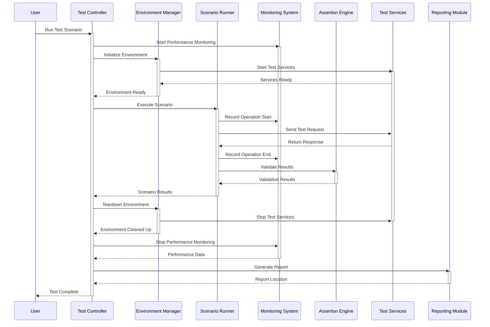

```mermaid
sequenceDiagram
    participant User
    participant TC as Test Controller
    participant EM as Environment Manager
    participant SR as Scenario Runner
    participant MS as Monitoring System
    participant AE as Assertion Engine
    participant S as Test Services
    participant RP as Reporting Module

    User->>TC: Run Test Scenario
    activate TC
    
    TC->>MS: Start Performance Monitoring
    activate MS
    
    TC->>EM: Initialize Environment
    activate EM
    EM->>S: Start Test Services
    activate S
    S-->>EM: Services Ready
    EM-->>TC: Environment Ready
    deactivate EM
    
    TC->>SR: Execute Scenario
    activate SR
    SR->>MS: Record Operation Start
    
    SR->>S: Send Test Request
    S-->>SR: Return Response
    
    SR->>MS: Record Operation End
    
    SR->>AE: Validate Results
    activate AE
    AE-->>SR: Validation Results
    deactivate AE
    
    SR-->>TC: Scenario Results
    deactivate SR
    
    TC->>EM: Teardown Environment
    activate EM
    EM->>S: Stop Test Services
    deactivate S
    EM-->>TC: Environment Cleaned Up
    deactivate EM
    
    TC->>MS: Stop Performance Monitoring
    MS-->>TC: Performance Data
    deactivate MS
    
    TC->>RP: Generate Report
    activate RP
    RP-->>TC: Report Location
    deactivate RP
    
    TC-->>User: Test Complete
    deactivate TC
```